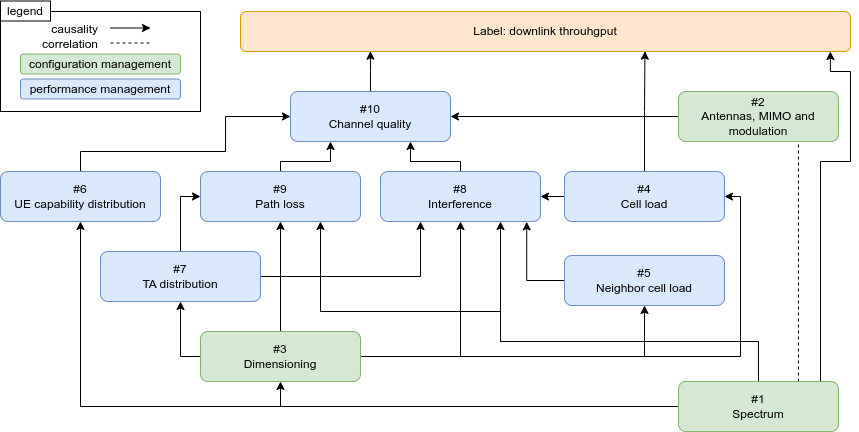

# Supplementary material for the paper "Theoretical Evaluation of Asymmetric Shapley Values for Root-Cause Analysis"

This repository contains the code we used to run the experiments in our paper.

# Information regarding features, groups

## Communities and Crime features semantic grouping

|Group name|Features
|---|---|
| Race|racepctblack, racePctWhite, racePctAsian, racePctHisp|
| Age|agePct12t21, agePct12t29, agePct16t24, agePct65up|
| Income|medIncome, pctWWage, pctWFarmSelf, pctWInvInc, pctWSocSec, pctWPubAsst, pctWRetire, medFamInc, perCapInc, NumUnderPov, PctPopUnderPov|
| Race/Income|whitePerCap, blackPerCap, indianPerCap, AsianPerCap, OtherPerCap, HispPerCap|
| Education|PctLess9thGrade, PctNotHSGrad, PctBSorMore, PctUnemployed, PctEmploy, PctEmplManu, PctEmplProfServ, PctOccupManu, PctOccupMgmtProf|
| Family|MalePctDivorce, MalePctNevMarr, FemalePctDiv, TotalPctDiv, PersPerFam, PctFam2Par, PctKids2Par, PctYoungKids2Par, PctTeen2Par, PctWorkMomYoungKids, PctWorkMom, NumKidsBornNeverMar, PctKidsBornNeverMar|
| Immigration|PctForeignBorn, NumImmig, PctImmigRecent, PctImmigRec5, PctImmigRec8, PctImmigRec10, PctRecentImmig, PctRecImmig5, PctRecImmig8, PctRecImmig10, PctSpeakEnglOnly, PctNotSpeakEnglWell|
| House|householdsize, PctLargHouseFam, PctLargHouseOccup, PersPerOccupHous, PersPerOwnOccHous, PersPerRentOccHous, PctPersOwnOccup, PctPersDenseHous, PctHousLess3BR, MedNumBR, HousVacant, PctHousOccup, PctHousOwnOcc, PctVacantBoarded, PctVacMore6Mos, MedYrHousBuilt, PctHousNoPhone, PctWOFullPlumb, OwnOccLowQuart, OwnOccMedVal, OwnOccHiQuart, OwnOccQrange, RentLowQ, RentMedian, RentHighQ, RentQrange, MedRent, MedRentPctHousInc, MedOwnCostPctInc, MedOwnCostPctIncNoMtg|
| Homelessness|NumInShelters, NumStreet|
| Native|PctBornSameState, PctSameHouse85, PctSameCity85, PctSameState85|
| Police|LemasSwornFT, LemasSwFTPerPop, LemasSwFTFieldOps, LemasSwFTFieldPerPop, LemasTotalReq, LemasTotReqPerPop, PolicReqPerOffic, PolicPerPop|
| Race/Police|RacialMatchCommPol, PctPolicWhite, PctPolicBlack, PctPolicHisp, PctPolicAsian, PctPolicMinor, OfficAssgnDrugUnits, NumKindsDrugsSeiz, PolicAveOTWorked, PolicCars, PolicOperBudg, LemasPctPolicOnPatr, LemasGangUnitDeploy, LemasPctOfficDrugUn, PolicBudgPerPop|
| Land/Pop|population, numbUrban, pctUrban, LandArea, PopDens, PctUsePubTrans|

## Mobile Telecommunications dataset feature groups

#### Configuration Management data

|Id|Name|\# of features|Description|
|---|---|---|---|
|\#1|Spectrum|7|Spectrum resources available for a given cell. Includes start frequency of the used band and channel bandwidth. |
|\#2|Antennas, MIMO and modulations|5|Other radio resource like capabilities of the cell including: number of antennas, MIMO capabilities, modulation capabilities. |
|\#3|Dimensioning|33|Configuration settings of the cell resulting from cell dimensioning: range, transmit power, signal strength threshold and hysteresis settings, etc. |

#### Performance Management data

|Id|Name|\# of features|Description|
|---|---|---|---|
|\#4|Cell load|4|Cell load metrics with statistics about the number of connected users and active users. |
|\#5|Neighbor cell load|4|Weighted average of load metrics from neighboring cells (weighted by handover counts). |
|\#6|UE cap. distr.|12|Radio capability distribution of connected users. |
|\#7|TA distr.|3|Timing Advance distribution of UEs within the cell (Timing Advance estimates the distance of the UE from the base station)  |
|\#8|Interference|3|Uplink interference distribution |
|\#9|Path loss|3|Uplink path loss distribution (expresses how much the transmitted power is attenuated by the radio channel between the UE and the base station) |
|\#10|Channel quality|4|Rank distribution within the cell |

# Repo Table of Contents

# Directories

### nam/

Contains experiments regarding neural networks (NAM). Please refer to the README.md of the subdirectory.

### data/

For convenience, we also include the necessary data files in the correct folder structure to run the code. These were downloaded from the UCI repository using the command `wget --recursive --no-parent http://archive.ics.uci.edu/ml/machine-learning-databases/00211/` and similar, and also uncompressed when necessary.

### output/

Rendered .pdf and .png charts and figures.

# Notebooks

### example-b-using-absval.ipynb

The incorrect attributions of Example B can also be demonstrated using average absolute values. This notebook contains the numerical simulation.

### cacu-features.ipynb

Experiments regarding feature pairs on the Communities and Crime Unnormalized dataset.

### cacu-semantic-grops.ipynb

Experiments regarding the semantic grouping of the Communities and Crime Unnormalized dataset.

### alldata-features.ipynb

Experiments regarding feature pairs in the four public datasets.

### alldata-random-groups.ipynb

Experiments regarding random groupings in the four public datasets.

# Environment

We used a python 3.8 environment with the following packages to run the experiments:

- lightgbm=3.3.5
- pandas
- numpy
- tqdm
- matplotlib
