# NAM experiments

## Setup

Please clone https://github.com/lemeln/nam to the "nam" repository under this folder and install its dependencies.

## Reproducing the NAM paper (https://neural-additive-models.github.io)

See `nam-reproduce.ipynb`. Figures show single-variable functions of the model.

There seems to be a very large randomness (see yellow lines) in the individual prediction functions. Dashed red lines signify 10 and 90 percentiles regarding the 20 trained functions. Blue is the average. (Same is visible in the original NAM paper).

## Single and double variable models

See `nam-asv.ipynb`. Figures show single-variable functions of models trained only on that single variable.

### Single variable models:

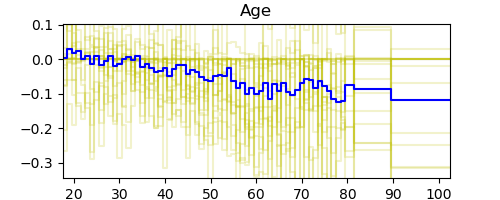

As we can say, these don't work very well. Looks like the probabilities are not well-calibrated, even if they give an ok AUC score. This is confirmed at the end of the notebook (`nam-asv.ipynb`) where we measure logit variances.

### Double variable models:

One line is two single-variable functions of the same model, trained on only those two variables.

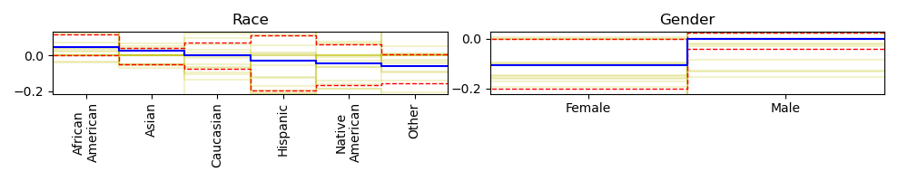
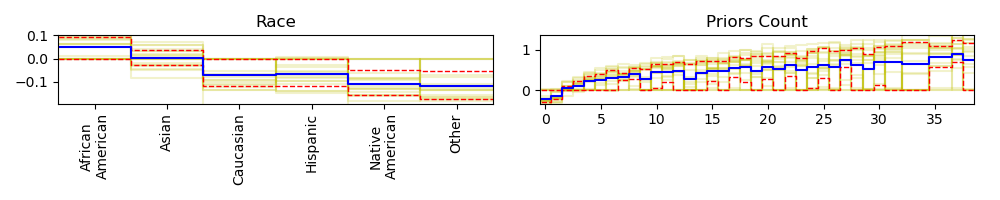
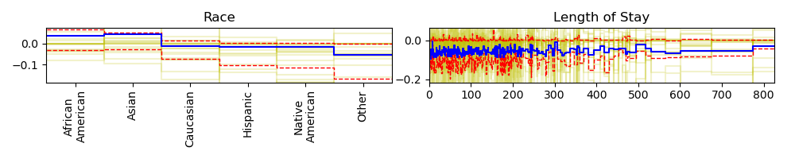

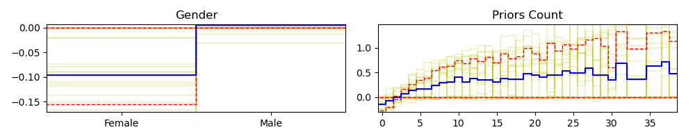

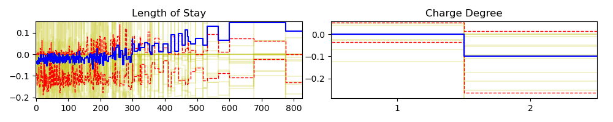

# Interactions
See `nam-asv.ipynb`. We check the predictive power ($r^2$) of single- and two-variable models (towards the logits predicted by the full model.

## Individual $r^2$ values of predictors:

|age|race|sex|priors_count|length_of_stay|c_charge_degree|
|---|---|---|---|---|---|
|0.043|0.036|0.017|0.045|0.005|0.029|

These are very weak, because (as observed before), the probabilities are not well calibrated.

## The $r^2$ values of two-variable models.

||age|race|sex|priors_count|length_of_stay|c_charge_degree|
|---|---|---|---|---|---|---|
|age||0.227|0.173|0.625|0.031|0.188|
|race|0.227||0.115|0.598|0.047|0.195|
|sex|0.173|0.115||0.467|0.040|0.069|
|priors_count|0.625|0.598|0.467||0.274|0.478|
|length_of_stay|0.031|0.047|0.040|0.274||0.070|
|c_charge_degree|0.188|0.195|0.069|0.478|0.070||

Much more believable! Unfortunately, using these together with single variable models would result in huge interactions, which are an artifact of the uncalibrated probabilities.

# Leave-one-out models and contributions as last feature

See `nam-asv-leave-one-out.ipynb`. Let's see how different the GAM contributions are from ASV contributions when measuring contributions of variables as the last included one in ASV.

### Simply plotting them side by side:

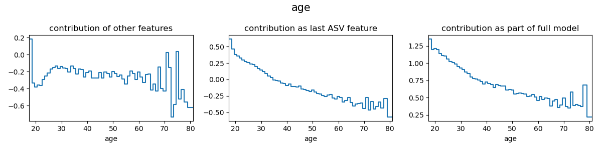

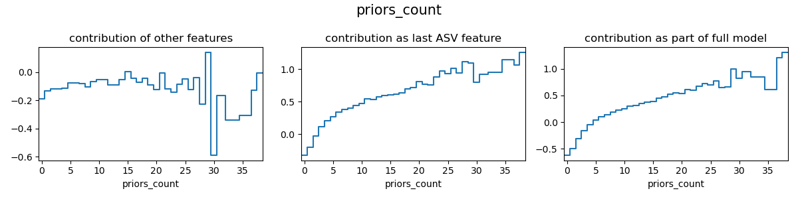

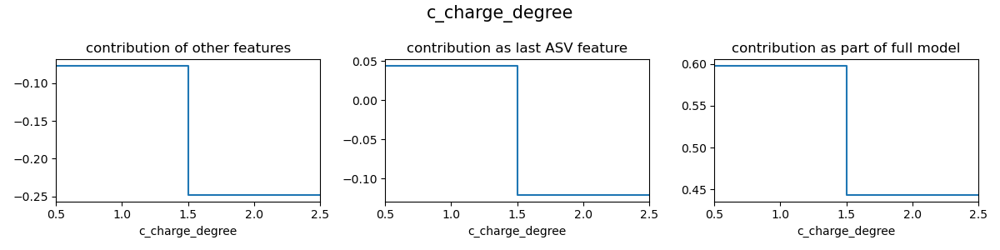

### Directly on the same plot:

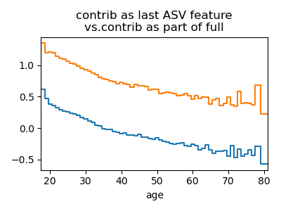
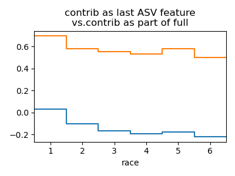

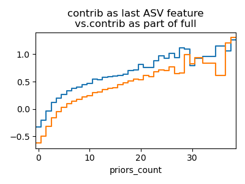

As we see, these are generally very similar, if a bit shifted (which does not affect variance). Very nice!
