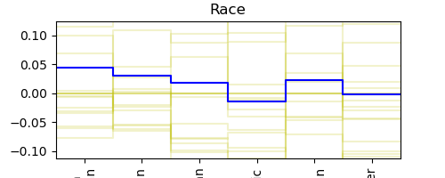
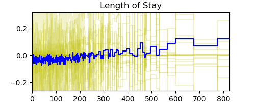
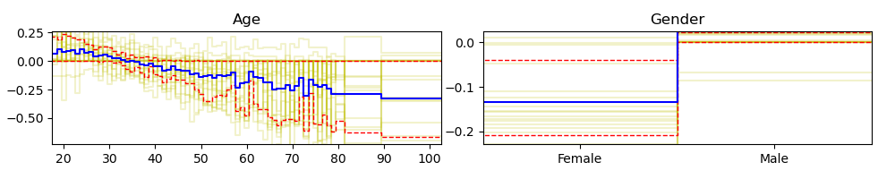
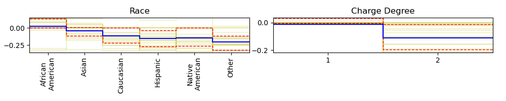

# NAM experiments

## Setup

Please clone https://github.com/lemeln/nam to the "nam" repository under this folder and install its dependencies.

## Reproducing the NAM paper (https://neural-additive-models.github.io)

See `nam-reproduce.ipynb`. Figures show single-variable functions of the model.

There seems to be a very large randomness (see yellow lines) in the individual prediction functions. Dashed red lines signify 10 and 90 percentiles regarding the 20 trained functions. Blue is the average. (Same is visible in the original NAM paper).

## Single and double variable models

See `nam-asv.ipynb`. Figures show single-variable functions of models trained only on that single variable.

### Single variable models:

As we can say, these don't work very well. Looks like the probabilities are not well-calibrated, even if they give an ok AUC score. This is confirmed at the end of the notebook (`nam-asv.ipynb`) where we measure logit variances.

### Double variable models:

One line is two single-variable functions of the same model, trained on only those two variables.

# Interactions

The code will be uploaded by 2023-07-03 12:00 UTC at the latest.